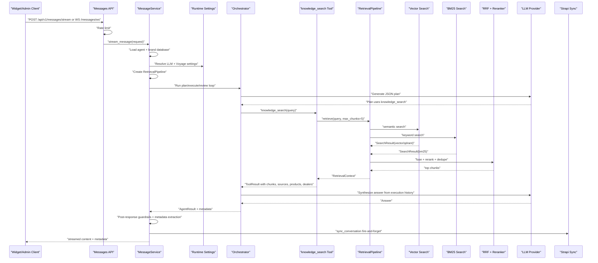

# NOVA Hybrid Search And Retrieval Guide

This guide explains how NOVA combines BM25 keyword search and vector search inside an agent response. It maps the current code path from a user message to the final answer, including which services are triggered, in what order, and what each stage returns.

## Where The Code Lives

- Message endpoints: `apps/api/app/api/v1/endpoints/messages.py`
- Message orchestration: `apps/api/app/services/message_service.py`
- Agent planner/executor: `packages/agent_runtime/src/agent_runtime/orchestrator.py`
- Retrieval tool wrapper: `packages/tools/src/tools/builtin/retrieval_tool.py`
- Retrieval pipeline: `packages/retrieval/src/retrieval/pipeline.py`
- Atlas vector search: `packages/retrieval/src/retrieval/vector/atlas_search.py`
- Qdrant vector search: `packages/retrieval/src/retrieval/vector/qdrant_search.py`
- Voyage embeddings client: `packages/retrieval/src/retrieval/vector/voyage_client.py`
- BM25 text search: `packages/retrieval/src/retrieval/bm25/text_search.py`
- RRF fusion: `packages/retrieval/src/retrieval/fusion/rrf.py`
- Reranker: `packages/retrieval/src/retrieval/fusion/reranker.py`
- Retrieval types: `packages/retrieval/src/retrieval/types.py`

## Short Version

NOVA does not directly inject knowledge into the prompt before planning. The current runtime lets the agent decide when to call the `knowledge_search` tool. When the planner chooses that tool, the tool runs a hybrid retrieval pipeline:

1. Detect query intent and apply content-type filters.
2. Run vector search and BM25 search against the brand-specific `knowledge_base` collection.
3. Fuse both result sets with Reciprocal Rank Fusion.
4. Rerank the fused candidates.
5. Apply optional boosts and deduplication.
6. Return concise chunks plus structured product/dealer metadata to the agent.
7. The orchestrator synthesizes the final answer from the tool result.
8. Response validation/guardrails run before the answer is returned.

## End-To-End Runtime Flow



## Detailed Flow

### 1. Client Sends A Message

The message enters through one of the message endpoints:

- `POST /api/v1/messages`
- `POST /api/v1/messages/stream`
- `WS /api/v1/messages/ws`

The endpoint applies the named rate-limit policy first:

- `widget_chat` for non-streaming HTTP
- `widget_stream` for SSE streaming
- `widget_ws_connect` and `widget_ws_message` for websocket traffic

After rate limiting, the endpoint calls `MessageService.process_message()` or `MessageService.stream_message()`.

### 2. MessageService Loads Agent Runtime

`MessageService` loads the agent from MongoDB system database by `agent_id`.

During `_load_agent_config()` it:

- Resolves the agent's brand.
- Opens the brand-specific MongoDB database.
- Normalizes and assembles prompt layers.
- Resolves LLM runtime settings.
- Resolves Voyage embedding/rerank settings.
- Creates `RetrievalPipeline`.
- Registers `RetrievalTool` as `knowledge_search`.
- Optionally registers Shopify MCP tools when the agent data source is Shopify.

The retrieval pipeline is brand-isolated. For Atlas and BM25, the brand slug becomes the MongoDB database name after replacing `.` with `_` and trimming to MongoDB's database-name limit.

### Vertical intent profiles

Hybrid RAG does not inherit plumbing, bathware, or any other vertical's
keywords globally. Commerce-neutral signals such as product, price, and SKU
remain available to all agents. A vertical-specific intent profile must be
explicitly configured in the agent runtime contract:

```json
{
  "domain": {
    "verticals": ["bathware"]
  }
}
```

The `bathware` profile enables terms such as faucet, commode, and basin for
both scope filtering and product-intent classification. Do not infer a profile
from a brand name, slug, or prompt text; that would contaminate generic, Lal
Kitab, and other agent use cases.

Example:

```text
brand_slug: essco-bathware
database: essco-bathware
collection: knowledge_base
```

### 3. Guardrails And Memory Run Before Planning

Before the agent plans, `MessageService` stores the user message in short-term memory and checks:

- sensitive-data patterns
- prompt-attack patterns
- graph safety escalations

If the message must be blocked or escalated, retrieval is skipped and a guardrail response is returned.

If allowed, the service builds memory context from:

- recent conversation messages
- user facts
- graph rules
- escalations
- summaries

This memory context is passed to the orchestrator. Retrieval is not automatically performed here in the current agent loop; retrieval happens when the orchestrator calls `knowledge_search`.

### 4. Orchestrator Plans Tool Usage

`Orchestrator.run()` asks the configured LLM to produce a strict JSON plan. The available tools include `knowledge_search`.

For a product query such as:

```text
basin pillar cock under 2000
```

the planner is expected to produce a step similar to:

```json
{
  "goal": "Find basin pillar cock product options under 2000",
  "steps": [
    {
      "id": 1,
      "thought": "Search the brand knowledge base for matching products.",
      "tool_name": "knowledge_search",
      "tool_input": {
        "query": "basin pillar cock under 2000"
      }
    }
  ]
}
```

If planning fails, the orchestrator falls back to a conservative direct answer.

### 5. `knowledge_search` Calls RetrievalPipeline

`RetrievalTool.run()` wraps `RetrievalPipeline.retrieve()` and requests concise results:

```python
context = await self.pipeline.retrieve(
    query=query,
    filters=filters or {},
    max_chunks=5,
)
```

The tool then returns:

- text snippets for the agent to read
- `sources`
- `confidence`
- `chunks_count`
- structured `products`
- structured `dealers`

Products and dealers are extracted from top-level `DocumentChunk.product_data` and `DocumentChunk.dealer_data`.

### 5.1 Retrieval Availability Contract

Retrieval distinguishes a valid empty search from a backend outage. Its
metadata has one of four safe statuses:

- `evidence`: at least one grounding chunk is available.
- `no_evidence`: every attempted backend completed, but no chunk matched.
- `degraded`: a backend failed while another completed; surviving chunks may
  still be used.
- `error`: no backend completed. The tool returns a generic retryable failure
  instead of presenting an ungrounded answer as retrieved knowledge.

`sources` and bounded citation candidates are returned only from usable
retrieval output. The message layer deduplicates and sanitizes them before
exposing response citations. Provider messages, connection details, and raw
exception text are deliberately not propagated to clients.

### 6. RetrievalPipeline Detects Intent And Filters Content

`RetrievalPipeline.retrieve()` first detects query intent with keyword matching and page context.

Current supported intents:

- `product_search`
- `dealer_search`
- `faq`
- `office`
- `category`
- `general`

Intent maps to content-type filters:

```python
{
    "product_search": ["product", "category"],
    "dealer_search": ["dealer", "office"],
    "faq": ["faq", "guide"],
    "office": ["office"],
    "category": ["category", "product"],
    "general": None,
}
```

For `basin pillar cock under 2000`, the likely intent is `product_search`, so both vector and BM25 searches get:

```python
{"content_type": {"$in": ["product", "category"]}}
```

### 7. Vector Search Runs

If `VECTOR_BACKEND=atlas`, NOVA uses `AtlasVectorSearch`.

Atlas vector search:

1. Calls `VoyageClient.embed_query(query)`.
2. Sends `POST <VOYAGE_BASE_URL>/embeddings`.
3. Uses the configured Voyage model, usually `VOYAGE_MODEL=voyage-3-large`.
4. Runs a MongoDB Atlas `$vectorSearch` aggregation against `knowledge_base`.
5. Searches the `embeddings` field using `VECTOR_INDEX_NAME`, usually `vector_index`.
6. Uses `numCandidates = min(top_k * 10, 1000)`.
7. Limits to `vector_top_k`, currently `50`.
8. Drops chunks below `similarity_threshold`, currently `0.7`.

If `VECTOR_BACKEND=qdrant`, NOVA uses `QdrantVectorSearch`.

Qdrant vector search:

1. Calls the same Voyage query embedding path.
2. Searches collection `<QDRANT_COLLECTION_PREFIX>_<brand>_knowledge_base`.
3. Applies content-type filters as Qdrant payload filters.
4. Uses `score_threshold=similarity_threshold`.

If Voyage returns `401` or `403`, the Voyage client marks itself auth-failed. Atlas vector search then skips vector search and returns an empty vector result. BM25 can still run.

### 8. BM25 Text Search Runs

BM25 search uses MongoDB text indexes through `BM25Search`.

The first time it runs in a process, it calls `create_text_index()` on:

```text
content text
title text
section text
```

with weights:

```python
{
    "title": 10,
    "section": 5,
    "content": 1,
}
```

Then it runs:

```python
{"$text": {"$search": query}}
```

and sorts by:

```python
{"$meta": "textScore"}
```

It returns up to `bm25_top_k`, currently `50`.

BM25 is especially useful for exact product terms, SKUs, model numbers, price words, city names, and other tokens where exact wording matters.

### 9. RRF Combines Vector And BM25 Results

`RRFFusion` combines search result lists by rank rather than by raw scores. This matters because vector scores and MongoDB text scores are not naturally comparable.

Formula:

```text
RRF score = sum(1 / (k + rank_i))
```

Current `k` is `60`.

If a chunk appears in both vector and BM25 results, it gets contributions from both rankings and usually rises. If a chunk appears in only one result set, it can still survive if it ranks highly there.

If only one backend returns results, RRF simply returns that backend's chunks.

### 10. Reranker Narrows The Candidate Set

If there are more fused chunks than `max_chunks`, `CrossEncoderReranker` reranks them.

For agent tool usage, `max_chunks=5`, so the usual flow is:

```text
50 vector candidates + 50 BM25 candidates
-> RRF top 50
-> rerank top 5
```

The reranker calls:

```text
POST <VOYAGE_BASE_URL>/rerank
```

with:

```json
{
  "query": "...",
  "documents": ["chunk content", "..."],
  "model": "rerank-2.5",
  "top_k": 5
}
```

If rerank auth fails with `401` or `403`, API reranking is disabled and NOVA falls back to heuristic reranking:

- 70% original score
- 30% query-term overlap

### 11. Boosts, Deduplication, And Structured Data

After reranking:

- Brand boost may run if `brand_boost_enabled` is true.
- Page boost may run if page context is present.
- Deduplication removes repeated `(doc_id, section)` pairs.
- Structured data enrichment copies metadata into `DocumentChunk.product_data` or `DocumentChunk.dealer_data` when needed.

The final `RetrievalContext` includes:

- `chunks`
- `confidence`
- `sources`
- `query`
- `filters_applied`
- `query_intent`
- `content_types_found`
- `boost_info`
- `retrieval_metadata`

### 12. Tool Result Goes Back To The Agent

`RetrievalTool` formats the top chunks as plain text:

```text
Found the following information:

[1] source_id: essco-bathware_product_ORB-CHR-105001N
Product: Pillar Cock
SKU: ORB-CHR-105001N
Category: Faucets & Mixers
Price: 1750 INR...
```

It also attaches metadata:

```json
{
  "confidence": 0.93,
  "sources": ["essco-bathware_product_ORB-CHR-105001N"],
  "chunks_count": 5,
  "products": [{ "sku": "ORB-CHR-105001N", "name": "Pillar Cock" }],
  "dealers": []
}
```

This metadata later becomes citations and product cards in the widget response.

### 13. Final Answer Is Synthesized And Validated

The orchestrator synthesizes an answer from the execution history. The answer is then checked by the response validator/critic path.

If the result is low confidence, `MessageService` can replace it with a safe fallback:

```text
I don’t have enough verified information in the knowledge base to answer that reliably...
```

The final response is stored in short-term memory and synced to Strapi with `StrapiClient.sync_conversation()`.

## Example: Product Query

User asks:

```text
basin pillar cock under 2000
```

Expected flow:

1. `MessageService.stream_message()` receives the request.
2. Agent config is loaded for the requested `agent_id`.
3. Retrieval pipeline is initialized for `essco-bathware`.
4. Orchestrator plans a `knowledge_search` step.
5. Retrieval detects `product_search`.
6. Retrieval applies `content_type in ["product", "category"]`.
7. Vector search looks for semantically similar product chunks.
8. BM25 search looks for exact tokens like `basin`, `pillar`, `cock`, and `2000`.
9. RRF favors chunks that appear high in both result lists.
10. Reranker selects the top 5 most relevant chunks.
11. `RetrievalTool` extracts product metadata.
12. Orchestrator synthesizes a grounded answer, usually listing matching products and prices.
13. Widget metadata includes product cards when `show product cards` is enabled.
14. Conversation is synced to Strapi.

## Why Hybrid Search Is Used

For an agent configured with the `bathware` profile, vector search is good at semantic matching:

- "tap for wash basin" can match "basin mixer" or "pillar cock"
- "budget bathroom faucet" can match relevant product categories

BM25 is good at exact matching:

- SKUs
- city names
- product names
- technical phrases
- exact budget terms or model identifiers

RRF lets NOVA use both without pretending their scores are directly comparable.

## Current Defaults

From `MessageService.retrieval_config`:

```python
vector_enabled=True
vector_top_k=50
similarity_threshold=0.7
bm25_enabled=True
bm25_top_k=50
rrf_k=60
rerank_enabled=True
rerank_top_k=12
brand_boost_enabled=bool(brand_id)
page_boost_enabled=True
dedup_enabled=True
```

Note: `RetrievalTool` calls the pipeline with `max_chunks=5`, so agent tool responses usually use the top 5 chunks even though the default pipeline rerank limit is 12.

## Operational Notes

- Production Atlas installs use `VECTOR_BACKEND=atlas`.
- Local/self-hosted vector search can use `VECTOR_BACKEND=qdrant`.
- Voyage settings come from AgentBuilder runtime settings, with env fallback:
  - `VOYAGE_API_KEY`
  - `VOYAGE_BASE_URL`
  - `VOYAGE_MODEL`
  - `VOYAGE_RERANK_MODEL`
- For MongoDB Atlas Model API keys, `VOYAGE_BASE_URL` should be `https://ai.mongodb.com/v1`.
- The Atlas vector index must target the `embeddings` field.
- Knowledge chunks are stored in the brand database under `knowledge_base`.
- BM25 creates a MongoDB text index automatically if possible.
- Vector failures do not necessarily break retrieval because BM25 can still return results.
- Reranker failures do not necessarily break retrieval because fallback reranking is available.
